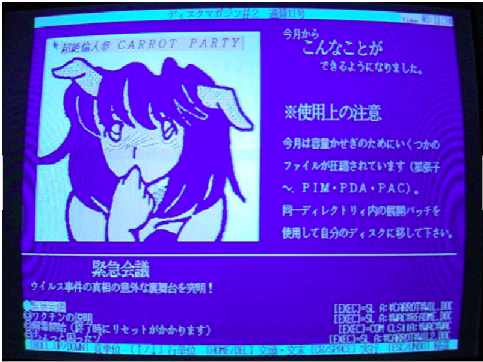
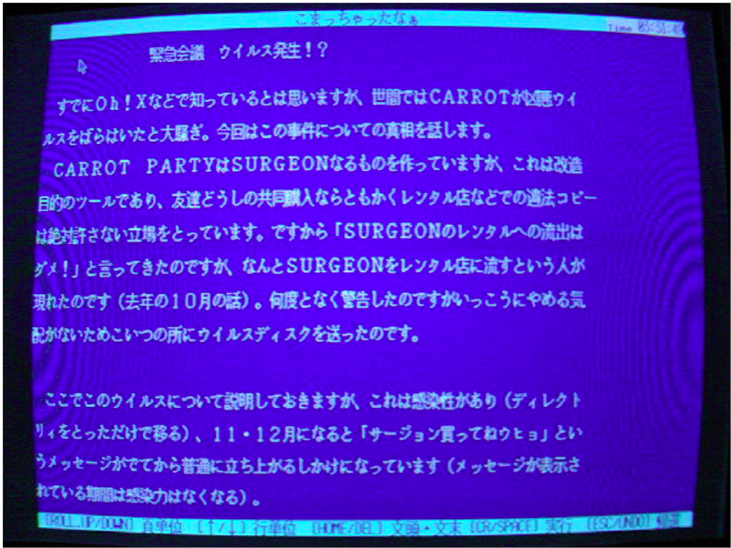
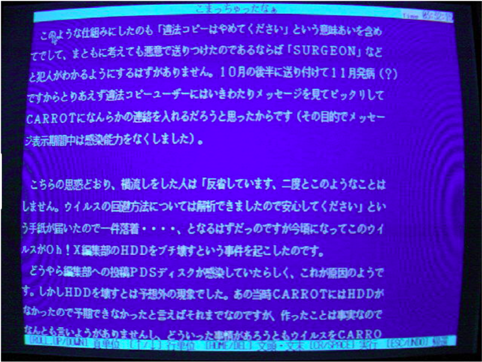
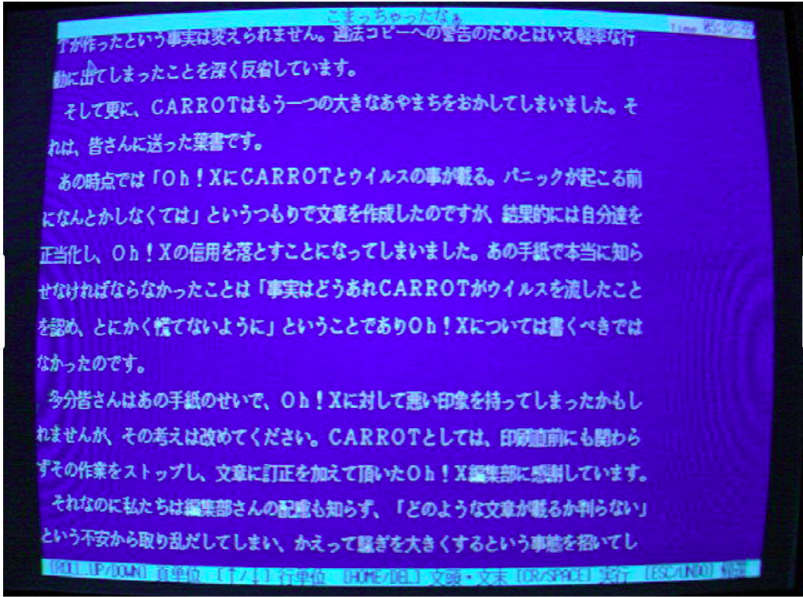
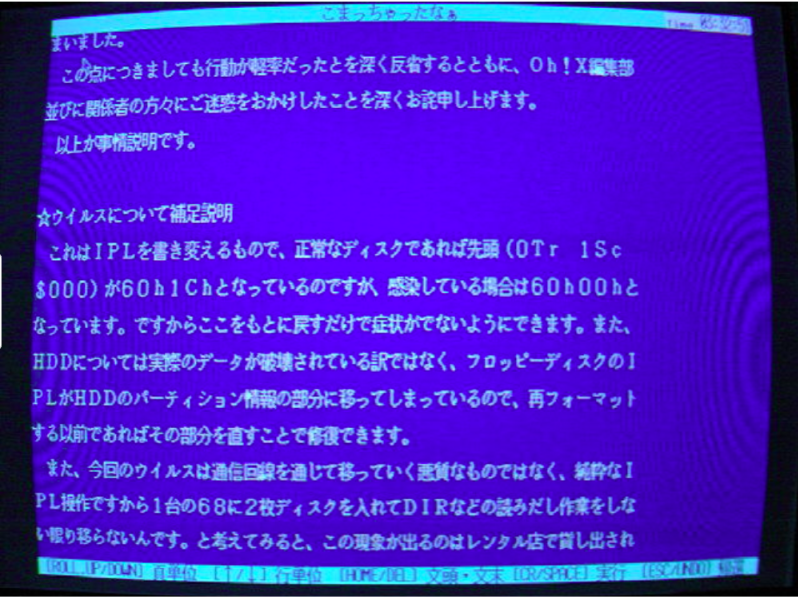
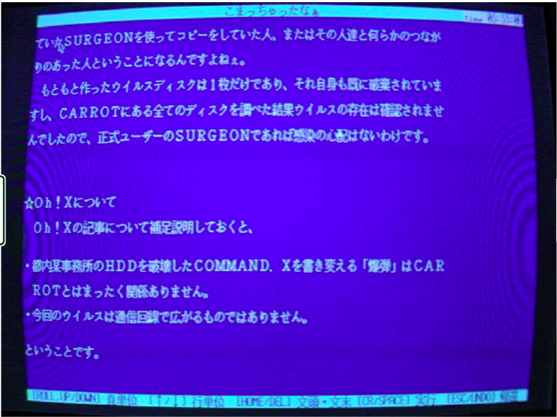
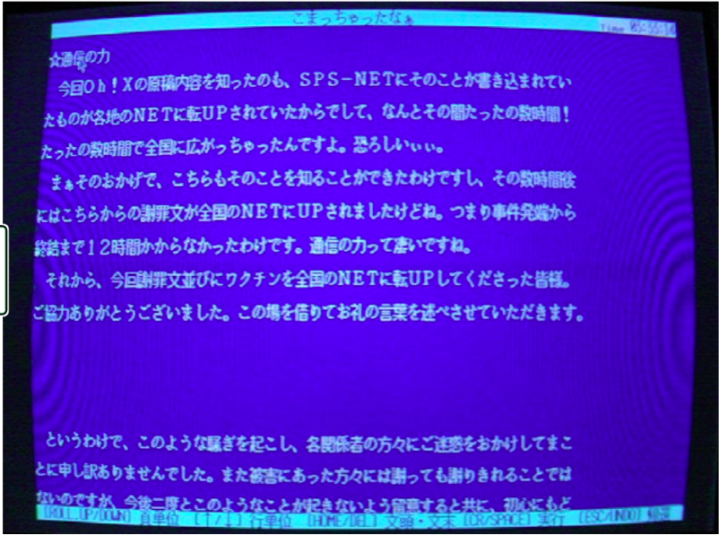
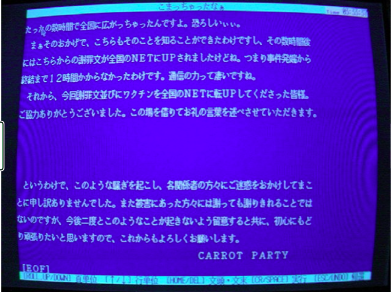

# The Surgeon Incident (1989)

## An early X68000 virus: The inside story from a Japanese 90'ies DiskMagazine

The Surgeon virus (サージョンウィルス) occupies a special place in
Japanese computer history. It is widely regarded as the first
domestically written Japanese computer virus, targeting the Sharp
X68000 platform in 1989.

Unlike many early viruses, however, Surgeon was not created as an
experiment in self-replicating code, nor apparently as an attempt at
indiscriminate destruction. According to a contemporaneous statement
published by its authors in the disk magazine **Carrot Party #2**, 
it originated as a targeted act against software piracy that escaped 
beyond its intended victim.

Attached to this story are screenshots with statements from Carrot Party.
We still do not have samples of the Surgeon virus. But we are looking.

# The X68000 community

The Sharp X68000 was a premium Japanese computer introduced in 1987.
It was - unsurprisingly - based on the Motorola 68000 CPU. 

It became popular among programmers, game developers, and enthusiasts.
The community was relatively small and tightly interconnected.

Software circulated through:

-   Commercial retail sales
-   User groups
-   Public Domain (PD) disk collections
-   Bulletin Board Systems (BBSes)
-   Software rental shops

# Software rental shops

During the late 1980s, Japanese rental stores sometimes rented software
in much the same way that video stores rented VHS tapes.

Many developers considered this harmful because a renter could simply
duplicate the floppy disk and return the original.

Independent developers in particular viewed this as a direct threat to
their livelihood.

# CARROT PARTY

CARROT PARTY was an amateur software circle active in the X68000
community.

Like many Japanese circles of the period, they produced utilities,
articles, and software distributed through their own disk magazine.

Issue #2 contains a lengthy explanation of what became known as the
"Surgeon incident".

# SURGEON was not originally the virus

One of the biggest misconceptions cleared up by the article is that
SURGEON was originally a legitimate software utility.

CARROT PARTY describe it as a tool for modifying software
(改造ツール), likely meaning a binary patching or customization utility.

They state that:

-   Friends were allowed to share it privately.
-   Redistribution through rental shops was forbidden.

# The conflict

According to CARROT PARTY, an individual ignored those wishes and began
distributing SURGEON through rental shops despite repeated requests to
stop. CARROT PARTY were annoyed by this and decided to retaliate.

# The virus

Rather than taking legal action---or simply accepting the piracy---they
wrote a virus.

In the screenshots they apparently state:

-   They created the virus.
-   They intentionally sent it to the unauthorized distributor.
-   It was designed to deliver a message.

The delayed payload displayed:

> **Surgeon買ってね！ウヒョ**

Which translates to:

> **"Buy Surgeon! Woohoo!"**

In this particular context, the message is "Instead of pirating our software, buy it."

# How the virus worked

The technical appendix provides several valuable details.

The virus infected the **IPL** (Initial Program Loader), the X68000
equivalent of a boot sector.

Rather than replacing the entire IPL, it altered the first branch
instruction.

  |Clean IPL | Infected IPL |
  |----------|--------------|
  |`60 1C`   | `60 00`      |

The authors also explain that:

-   The virus became memory resident after boot.
-   Simply performing operations such as `DIR` on another floppy caused
    that disk to become infected.
-   No telecommunications were involved.

------------------------------------------------------------------------

# Delayed activation

According to CARROT PARTY:

-   Infection occurred normally.
-   During November and December the warning message appeared.
-   Once the warning phase began, infection capability was disabled.

This appears intended to ensure that the intended recipient would see
the warning without the virus continuing to spread indefinitely.

------------------------------------------------------------------------

# Hard disk damage

The authors claim that user data was not actually erased.

Instead:

-   Floppy IPL data overwrote the HDD partition information.
-   Repairing that area restored the disk provided it had not been
    reformatted.

------------------------------------------------------------------------

# The escape

CARROT PARTY say they expected only one person to receive the infected
disk.

Instead:

-   The virus spread through ordinary floppy use.
-   Infected disks circulated beyond the original target.
-   Eventually an infected Public Domain disk reached the editorial
    office of Oh!X.

------------------------------------------------------------------------

# Oh!X

Oh!X was the leading commercial magazine devoted to the Sharp
X68000.

When one of its editors became infected, the story rapidly became public
knowledge throughout the Japanese X68000 community.

------------------------------------------------------------------------

# Communications in 1989

CARROT PARTY describe learning about the incident because reports
appeared on SPS-NET, from where they propagated to numerous Japanese
BBS networks.

They report that:

-   News spread nationwide within only a few hours.
-   Their explanation and antivirus ("vaccine") were uploaded to
    networks almost immediately.
-   Less than twelve hours elapsed between discovery of the incident
    and the coordinated response.

------------------------------------------------------------------------

# Public apology

One remarkable aspect of the article is its tone.

CARROT PARTY repeatedly acknowledge responsibility:

-   They created the virus.
-   They released it.
-   They failed to anticipate the consequences.
-   They caused unnecessary trouble for **Oh!X**.
-   They deeply regretted their actions.

They also admit that an earlier public statement had been poorly handled
and had unfairly damaged Oh!X's reputation.

------------------------------------------------------------------------

# Other malware

The article distinguishes Surgeon from another malicious program named
**瞬刻 (Shunkoku)**, which modified **COMMAND.X**.

CARROT PARTY state that **Shunkoku had absolutely no connection with
them.**

------------------------------------------------------------------------

# Historical significance

Viewed today, the Surgeon incident is interesting.

- Technically, it represents one of the earliest known Japanese
boot-sector viruses for the X68000.

- Socially, it is a window into the tensions surrounding software piracy in
Japan's late-1980s hobbyist computing scene.

- Historically, it produced one of Japan's earliest documented coordinated
malware responses: Reports spreading fast across BBS networks, distribution
of a disinfection utility, and a public post-incident explanation by the
authors themselves.

The **Carrot Party #2** preserves something rare in malware history: a 
detailed first-person account from the creators. While later retellings 
often reduce Surgeon to "Japan's first virus," this contemporaneous 
document reveals a more complex story involving independent software 
development, piracy, retaliation, unintended consequences, and public 
accountability.

    
Source: https://ameblo.jp/koorogiyousyoku/entry-11866406121.html

